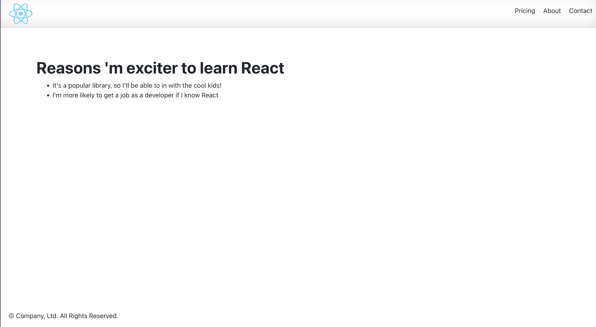
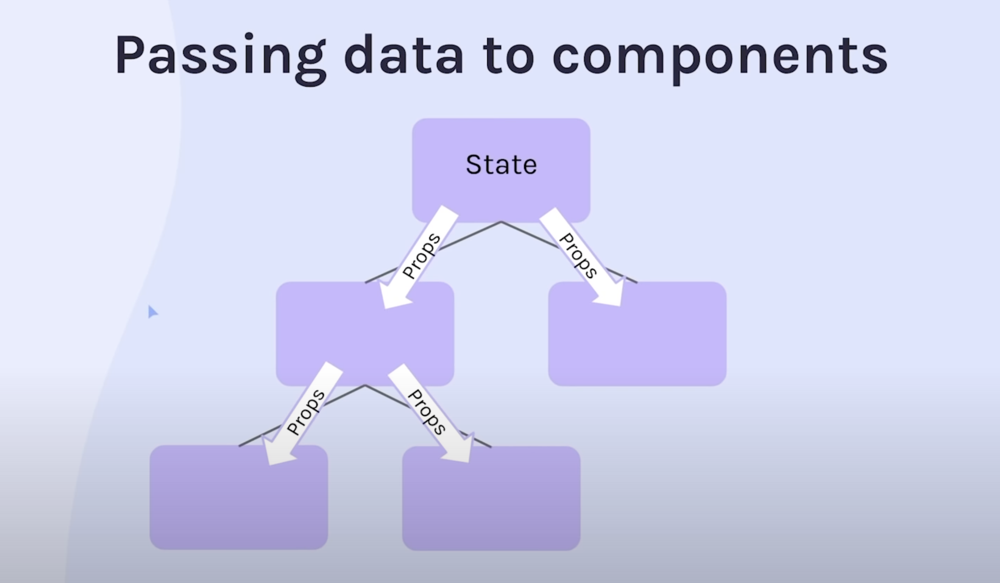

# React revision
- Why React
- JSX
- Custom Components
- Styling
- Static Pages
###  Project 1

### Project 2

# Data Driven React 
## What we'll learn
- Props
- Creating Components from an array
### Project 3

- how to use useState() 
- use useState() with complex data structures

- 
- 

